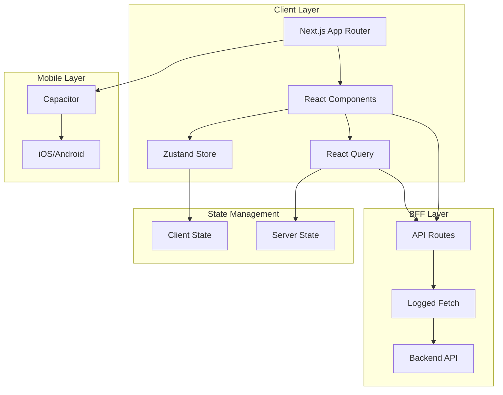
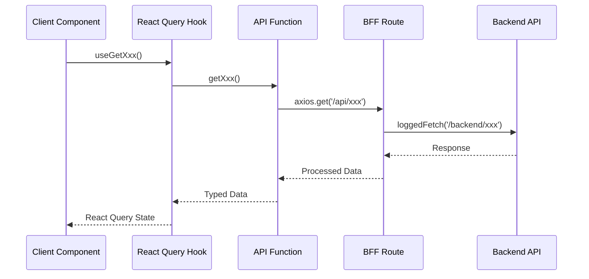
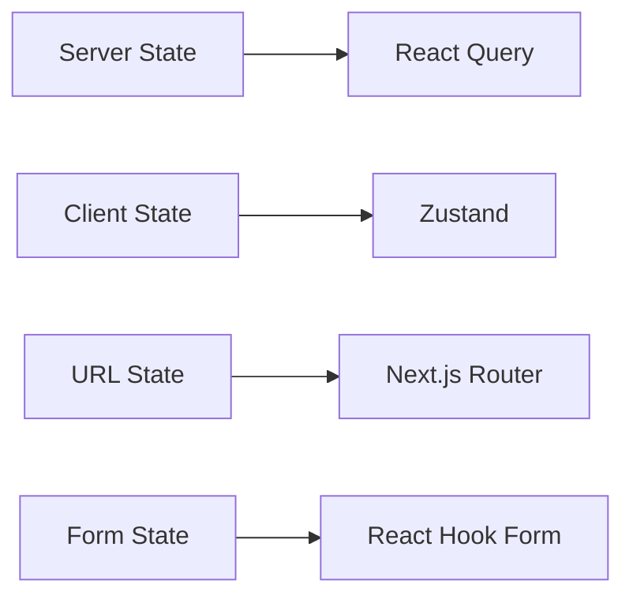

# Yoursaju Web Project Blueprint

## Project Overview

Yoursaju Web is a Next.js-based mobile web application that can be built as iOS/Android native apps using Capacitor. The project follows BFF (Backend for Frontend) pattern and uses modern React patterns with TypeScript.

### Architecture Diagram



### Technology Stack

> **See `libraries` rule for complete library definitions, usage patterns, and best practices.**

#### Core Framework

- **Next.js**: 15.5.9 (App Router)
- **React**: 19.2.3
- **TypeScript**: 5.9.3 (strict mode)
- **Node**: ^20

#### Key Libraries

- **Styling**: Tailwind CSS 4, tailwind-merge, tailwindcss-safe-area-capacitor
- **State**: Zustand (client), React Query (server)
- **HTTP**: Axios
- **Mobile**: Capacitor 6.1.2 (iOS/Android)
- **UI**: react-hot-toast, react-loading-skeleton, swiper, lottie-react
- **Utils**: date-fns, uuid, browser-image-compression, idb
- **Monitoring**: Datadog, Firebase
- **Dev Tools**: Prettier, ESLint, Jest

## File Structure

> **See `file-structure` rule for complete file structure rules, placement guidelines, and naming conventions.**

### Quick Reference

- **API Routes**: `src/app/api/{endpoint}/route.ts`
- **Client API**: `src/api/{domain}/index.ts`
- **Components**: `src/components/{shared|(pages)}/{ComponentName}.tsx`
- **Hooks**: `src/hooks/api/{domain}/useXxx.ts`
- **Stores**: `src/store/useXxxStore.tsx`

## Architecture Patterns

### BFF Pattern Flow



### State Management Flow



### Component Hierarchy

```mermaid
graph TB
    A[RootLayout] --> B[Providers]
    B --> C[ThemeProvider]
    B --> D[ReactQueryProvider]
    B --> E[ToastProvider]
    B --> F[MaintenanceProvider]
    B --> G[RefCodeProvider]
    G --> H[Page Layout]
    H --> I[Parallel Routes]
    I --> J[@Navbar]
    I --> K[@MenuBar]
    I --> L[Page Content]
```

## Key Patterns

### 1. API Request Flow

- Client → React Query Hook → API Function → BFF Route → Backend API
- Automatic token refresh via axios interceptor
- Error handling via React Query provider

### 2. Component Pattern

- Server Components by default
- Client Components with `'use client'`
- Shared components in `shared/`
- Page components in `(pages)/`

### 3. State Pattern

- Server state: React Query
- Client state: Zustand
- URL state: Next.js router
- Form state: React Hook Form (when needed)

### 4. Styling Pattern

- Tailwind CSS utility classes
- `twMerge` for class composition
- Custom font sizes: `text-text_XX_XX`
- Safe area utilities: `pb-safe`, `pt-safe`

### 5. Mobile Pattern

- Capacitor for native features
- Platform detection: `window.Capacitor?.isNativePlatform()`
- Safe area handling
- Mobile-first responsive design (max-width: 430px)

## Related Rules

- `libraries`: Complete library definitions and usage
- `file-structure`: Detailed file structure rules
- `project-standards`: Coding standards and patterns
- `component-patterns`: Component implementation patterns
- `api-patterns`: API integration patterns
- `state-management`: State management patterns
- `mobile-capacitor`: Mobile development patterns
